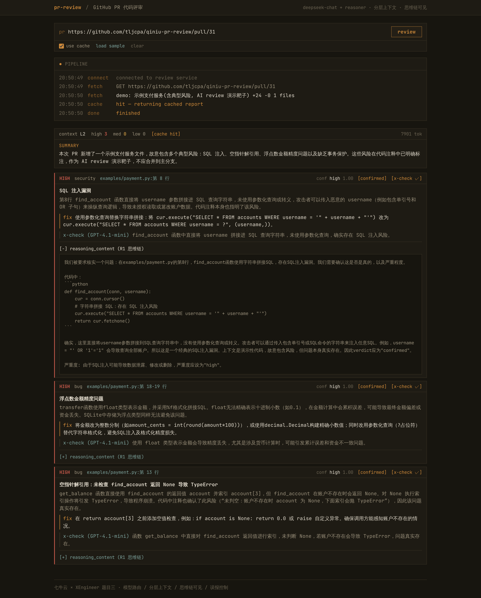
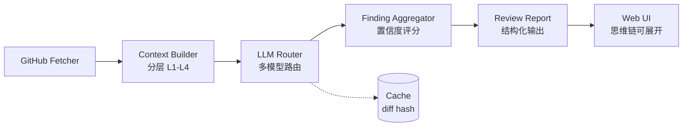

# AI PR Review 助手

> 七牛云 × XEngineer 暑期实训营 · 题目三作品
>
> 指定一个 GitHub Pull Request，系统自动拉取代码变更并用大模型智能分析，输出**变更总结、风险代码识别、Review 建议**，并把 AI 的推理思维链展示出来，让评审不再是黑盒。

- 在线试用：**https://pr.qiniu.zdwktlj.top** （已上线，可直接体验）
- 演示视频：**[▶ 点击播放 226 秒 Demo](https://pr.qiniu.zdwktlj.top/demo/pr-review-demo.mp4)** （自托管录屏，含旁白+字幕：注册登录 → 绑定 PAT → AI 审查 → R1 思维链 → AI 修复闭环（DeepSeek 生成补丁 + GPT-4.1-mini 交叉验证 + GitHub PAT 自动开 PR））
- 架构文档：[docs/ARCHITECTURE.md](docs/ARCHITECTURE.md)
- 决策与踩坑总账：[docs/复盘.md](docs/复盘.md)



> 上图：评审一个含风险的 PR，系统识别出 SQL 注入 / 浮点金额 / 空指针三处高危，每条带置信度、可展开的 R1 思维链，并经 GPT-4.1-mini 交叉验证（`[x-check ✓]`）。

---

## 核心特性

- **模型选择策略**：`deepseek-chat` 快扫标可疑 → `deepseek-reasoner` 深读并保留思维链（`reasoning_content`）→ 高风险项用 `GPT-4.1-mini` 交叉验证。直接回应题目"模型选择设计思路"。
- **分层上下文工程（L1-L4）**：按 diff 规模与 token 预算动态决定喂多少上下文，超预算时**主动声明"本段未完整 review"**而非强行截断输出错结论。
- **思维链可见化**：每条 finding 可展开查看 reasoner 的推理过程，可解释性拉满。
- **误报控制**：每条 finding 标 high/medium/low 置信度，低置信默认折叠；高风险项二次交叉验证。
- **增量评审 + 缓存**：同一 PR 多次 push 只 review 新增 diff（diff hash 缓存）。

## 快速开始

```bash
# 1. 配置环境变量
cp .env.example .env && vim .env        # 填入 DEEPSEEK_API_KEY 等

# 2. 安装依赖并启动后端
make install
make run                                 # 等价于 uvicorn app.main:app --port 8080

# 3. 冒烟测试
curl http://localhost:8080/api/health    # -> {"status":"ok",...}

# 4. 跑单元测试（85+，全离线、不需要任何 API key）
make test
```

Docker 方式：

```bash
docker compose up -d --build
```

## 系统架构



详见 [docs/ARCHITECTURE.md](docs/ARCHITECTURE.md)。

## 设计文档

题目明确要求说明的三大设计点，各有一份专门文档：

- 模型选择：[docs/MODEL_SELECTION.md](docs/MODEL_SELECTION.md)
- 上下文获取：[docs/CONTEXT_ENGINEERING.md](docs/CONTEXT_ENGINEERING.md)
- 扩展方向：[docs/FUTURE_WORK.md](docs/FUTURE_WORK.md)
- 完整决策与踩坑总账：[docs/复盘.md](docs/复盘.md)

## 技术栈

| 层 | 选型 |
|---|---|
| 后端 | Python + FastAPI（async / Pydantic / 自动 OpenAPI） |
| LLM SDK | openai-python（DeepSeek 兼容 OpenAI 协议，一套通吃多 provider） |
| GitHub | PyGithub |
| 前端 | Vite + React + TypeScript + Tailwind |
| 部署 | Docker Compose + Caddy 自动 HTTPS |

明确**不使用** LangChain / LlamaIndex —— 核心链路自己实现，约几百行，更显工程功底，也便于精确控制上下文与 token 预算。

## 开发与提交规范

本项目全程走 **feature 分支 + PR** 工作流，每个 PR 只做一件事、含「标题 / 功能描述 / 实现思路 / 测试方式」四段说明，main 分支始终保持可运行。提交历史即开发过程的体现。

## AI 协作声明

本项目在开发过程中使用 **Claude Code** 辅助编码，并在产品内集成了 DeepSeek 与 Azure OpenAI 模型。比赛规则明确允许且鼓励使用 AI 工具，这里诚实说明协作方式。

**AI 主导编写的部分**：后端核心链路（LLM 抽象层、GitHub 拉取、分层上下文、模型路由、聚合、缓存、API）、前端 React 组件、单元测试、部署脚本的初版代码，均由 AI 在明确的设计约束下编写。

**人主导的关键决策**（写在 [docs/复盘.md](docs/复盘.md) D-XX）：技术选型、上下文分层边界、模型路由顺序、置信度评分公式、前端视觉方向（"反 AI 味"的克制深色工具风是人工设定的硬验收标准）。AI 提方案、讲清取舍，人拍板。

**AI 写错并被修正的真实记录**（[docs/复盘.md](docs/复盘.md) L-XX）：
- `.env` 用相对路径，本地能跑、部署到服务器后 key 静默为空导致全部 LLM 调用失败（L-03）；
- 去重键初版按"标题前缀"，单测当场暴露同一问题措辞不同会漏合并，改用"位置"（D-18）；
- 引入交叉验证后单测从 0.9s 变 143s——测试在偷偷打真实网络（L-04）；
- 后台任务态 dict 无界增长的内存泄漏（L-05）。

这些都不是事后补的漂亮话，而是开发中真实发生、通过测试与在真实服务器上验证才发现并修掉的。**所有代码经过人工审阅、单元测试（85 个）与真实环境端到端验证后定型。**

完整开发过程见提交历史（全程 feature 分支 + PR 工作流）与 [docs/复盘.md](docs/复盘.md)。

## 开源协议

[MIT](LICENSE)
