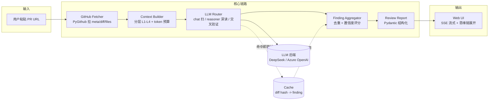
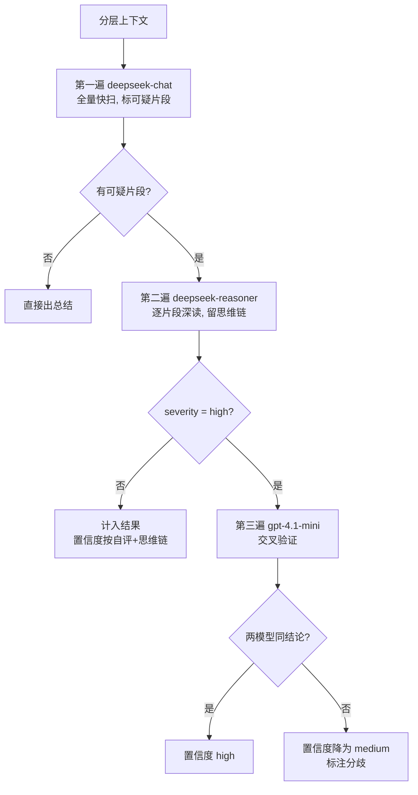
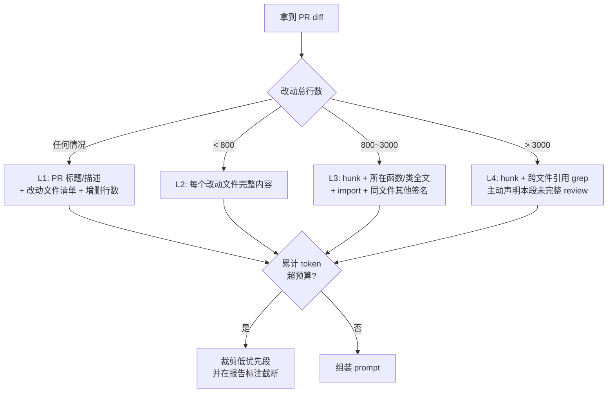

# 系统架构

> AI PR Review 助手 · 详细架构文档
> 本文档覆盖题目要求的三大设计点：**模型选择**、**上下文获取方式**、**未来扩展方向**。
> 关键决策的完整推导（为什么这么做 / 为什么不那么做 / 改变条件）见 [复盘.md](复盘.md)。

---

## 1. 设计目标与约束

题目本质：**用户指定 GitHub PR → 自动拉变更 → 智能分析 → 输出（总结 / 风险 / 建议）**。

评审真实痛点，对应到本系统的设计回应：

| 痛点 | 设计回应 |
|---|---|
| PR 太长，上下文塞不下，模型截断输出错结论 | 分层上下文 L1-L4 + token 预算，超预算主动声明未完整 review |
| AI 给结论像黑盒，评审不敢信 | reasoner 思维链 `reasoning_content` 全程可见可展开 |
| 误报多，淹没真问题 | 置信度分级 + 高风险二次交叉验证，低置信默认折叠 |
| 慢 | chat 快扫 + reasoner 仅深读可疑片段 + diff hash 缓存增量 |

---

## 2. 系统总览



---

## 3. 模块职责

| 模块 | 文件（落地 PR） | 职责 |
|---|---|---|
| LLM 抽象层 | `services/llm_provider.py` (PR3) | 统一封装 DeepSeek 与 Azure OpenAI；指数退避；透出 `reasoning_content` |
| GitHub 拉取 | `services/github_fetcher.py` (PR4) | 拉 PR 元信息 / diff / 改动文件内容；分页避免大 PR 超时 |
| 上下文构建 | `services/context_builder.py` (PR5) | 按改动规模选 L1-L4；token 预算动态裁剪；生成喂给模型的分段 prompt |
| 模型路由 | `services/router.py` (PR6) | 三段式：chat 快扫 → reasoner 深读 → gpt-4.1-mini 交叉验证 |
| 数据模型 | `models/finding.py` (PR7) | `Finding` / `ReviewReport` 的 Pydantic schema + 置信度评分 |
| 缓存 | `services/cache.py` (PR8) | diff hash → finding 缓存，支持增量 review |
| API | `api/*.py` (PR9) | FastAPI 路由：`POST /review`、`GET /review/{id}`、SSE 流式 |
| 前端 | `frontend/` (PR10) | Vite+React+Tailwind：URL 输入、实时输出、思维链展开、置信度折叠 |

---

## 4. 设计点一：模型选择策略

题目原文明确要求说明"模型选择设计思路"。本系统用**三段式路由**，让每个模型干它最划算的活：



理由（详见复盘 D-06）：
- **不全程上 reasoner**：reasoner 贵且慢，对明显无风险代码是浪费。先用便宜的 chat 过滤，再让 reasoner 只啃硬骨头，成本/质量平衡。
- **交叉验证只给 high**：Azure 配额 10k TPM 有限，把第二意见花在最可能影响合并决策的高风险项上。
- **reasoning_content 全保留**：这是与市面工具的核心差异——评审看得到"AI 为什么这么判"，而非黑盒。

---

## 5. 设计点二：上下文获取方式（分层上下文工程）

不是把整个 diff 一股脑塞进 prompt，而是**按改动规模分层，受 token 预算动态裁剪**：



层级边界与默认 token 预算（24k）见复盘 D-05，阈值在 PR5 用真实 PR 实测后调优。

**关键原则：超预算时主动声明"本段未完整 review"，而不是强行截断后输出错结论。** 这是误报/漏报控制的一部分——宁可诚实说"没看全"，不可假装看全了乱判。

---

## 6. 设计点三：误报控制与置信度

每条 finding 带 `confidence ∈ {high, medium, low}`，原始信号来自三处：

1. **模型自评**：prompt 里要求模型对每条问题自报置信度
2. **思维链长度/明确度**：reasoner 推理越充分、定位越具体，置信度越高
3. **是否被二次验证肯定**：交叉验证同结论 → high，分歧 → medium

UI 上 **low 置信默认折叠**，用户主动展开。这样既不漏报（仍然列出），又不让低质量猜测淹没真问题。

---

## 7. 缓存与增量评审

- 缓存 key = `sha1(file_path + start_line + end_line + content)`
- 同一 PR 多次 push，只对**新增/变化的 diff 片段**重新调模型，命中缓存的片段直接复用 finding
- 演示价值：现场改代码再重跑，体感很顺；也实测得出缓存命中率数字

---

## 8. 技术选型一览

| 层 | 选型 | 一句话理由（详见复盘 D-01~D-04） |
|---|---|---|
| 后端 | FastAPI | async 适配 SSE 流式与多模型并发；Pydantic 当结构化输出 schema |
| LLM SDK | openai-python | DeepSeek 兼容 OpenAI 协议，一套 SDK 通吃多 provider |
| GitHub | PyGithub | 拉 PR diff/files/meta 成熟，分页可控 |
| 前端 | Vite+React+Tailwind+shadcn/ui | 3 天内开发最快、UI 现代 |
| 部署 | Docker Compose + Caddy | 三项目共一台 VM，需隔离干净 + 自动 HTTPS |

**明确不用 LangChain / LlamaIndex**：核心链路（拉取→分层→路由→聚合）自己写约几百行，更可控、更显工程功底，也便于精确管理 token 预算与思维链透出。

---

## 9. 目录结构

```
pr-review/
├── backend/
│   ├── app/
│   │   ├── main.py          # FastAPI 入口（应用工厂）
│   │   ├── config.py        # pydantic-settings 配置
│   │   ├── api/             # 路由层 (PR9)
│   │   ├── services/        # 业务核心 (PR3-PR8)
│   │   ├── models/          # Pydantic 数据模型 (PR7)
│   │   └── core/            # 基础设施
│   └── requirements.txt
├── frontend/                # Vite+React (PR10)
├── docker/Dockerfile.backend
├── docker-compose.yml
└── docs/                    # 架构 / 复盘 / 设计文档
```

---

## 10. 未来扩展方向

题目要求说明"未来扩展方向"。当前 72 小时聚焦核心链路，规划中的扩展：

- **语义上下文层**：在 L3/L4 间用 sqlite-vec 做相似函数召回，提升跨文件理解
- **本地仓库 / 私有部署模式**：企业不愿把私有代码给公网 LLM，支持接本地模型（vLLM）
- **多语言专项规则**：针对不同语言的常见坑（如 Go 的 nil、Python 的可变默认参数）做定向 prompt
- **PR 评论回写**：直接以 inline comment 形式把 finding 发回 GitHub PR
- **质量趋势看板**：跨多个 PR 统计风险类型分布，给团队看代码质量趋势

详见 docs/FUTURE_WORK.md（PR13 补全）。
